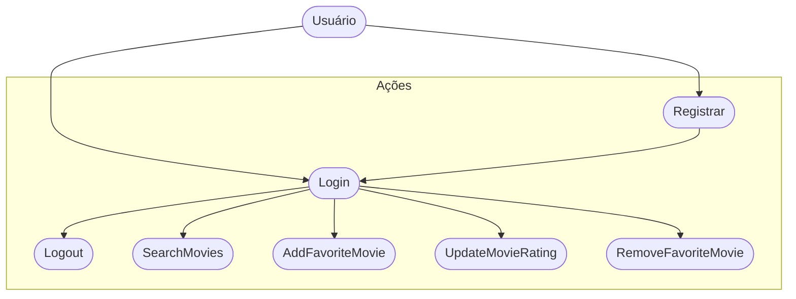

# CineFavorite (Formativa)

## Briefing
Construir um aplicativo do zero - O CineFavorite que permitirá criar uma conta e buscar filmes em uma API, montar uma galeria pessoal de filmes favoritos, com poste(capa) e nota avaliativa do usuário para o filme.

## Objetivos
- Criar uma galeria personalizada por usuuário de filmes favoritos
- Buscar filmes em uma API e listar para selecionar filmes favoritos
- Criação de contas por usuário
- Listar filmes por palavra-chave

## Levantamento de Requisitos
- ### Funcionais
- ### Não Funcionais

## Recursos do Projeto
- Linguagem de Programação: Flutter/Dart
- API TMDB: Base de Dados para Filmes
- Figma: Prototipagem
- GitHub: para Armazenamento e Versionamento do Código
- Firebase: Authentication / FireStore DB
- VSCode: Codificação / Teste

## Diagramas
1. ### Clase:
Demonstrar o Funcionamento das Entidades do Sistema
- Usuário: (User): Classe já modelada pelo FireBaseAuth
    - Atributos: email, senha, uid
    - Métodos: login, registrar, logout

- Filmes Favoritos (Movie): Classe modelada pelo DEV - Baseada na API TMDB
    - Atributos: id, titulo, posterPath, nota
    - Métodos: adicionar, remover, listar, atualizarNota (CRUD)

```mermaid

classDiagram

    class User{
        +String uid
        +String email
        +String password
        +login()
        +logout()
        +register()
    }

    class Movie{
        +int id
        +String title
        +String posterPath
        +double Rating
        +addFavorite()
        +removeFavorite()
        +updateMovieRating()
        +getFavoriteMovies
    }

    User "1"--"1+" : "Select"

```

2. ### Uso
Ação que os atores podem fazer
- Usuário
    - Registrar
    - Login
    - Logout
    - Adicionar Filmes Favorito
    - Procurar Filmes na API
    - Dar Nota aos Filmes Favoritos
    - Remover Filmes dos Favoritos



3. ### Fluxo
Determinar o Caminho Percorrido pelo ator para executar uma Ação
- FLuxo da Ação de Login

```mermaid

    A[Início] --> B{Tela de Login}
    B --> C[Inserir Email e Senha]
    C --> D{Validar as Credenciais}
    D --> Sim --> G[Favorite View]
    D --> Não --> B

```

## Prototipagem

Link dos Protótipos
https://www.figma.com/design/ZsVuuUBOUR5VwH90vBOCi4/Untitled?t=exxC4vrlPb9G39hi-1

## Codificação